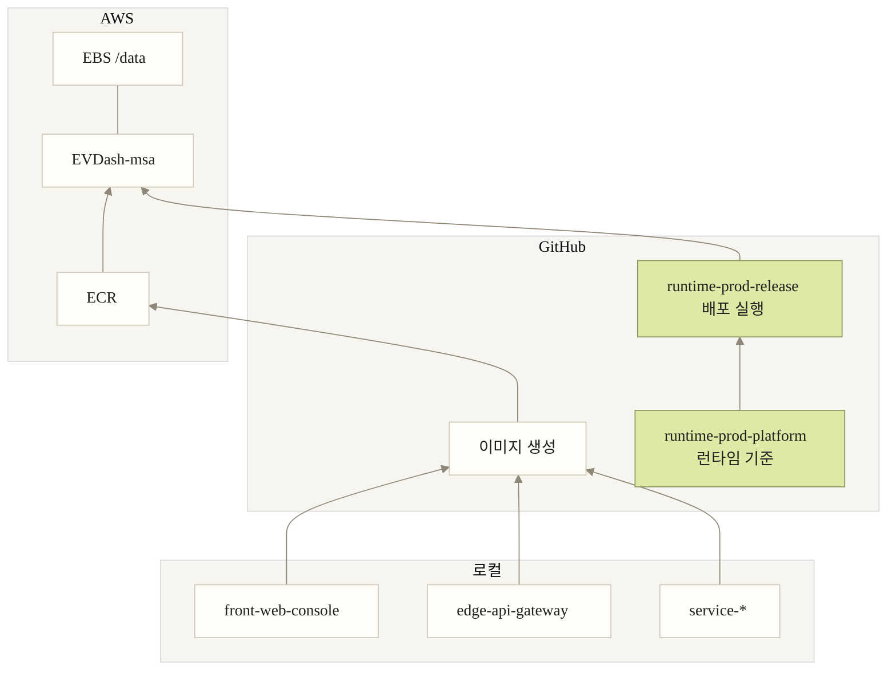

# Prod Runtime Deployment Diagram

이 문서는 현재 `ev-dashboard` 운영 배포 구조를 요약한 정본 다이어그램이다.

- 상단: `AWS`
- 중단: `GitHub`
- 하단: `로컬`
- 선 위 텍스트는 두지 않고, 박스와 배치만으로 흐름을 읽는다.

## Reading Guide

1. 로컬 구현 repo에서 이미지를 만든다.
2. GitHub가 이미지를 `ECR`로 올린다.
3. `runtime-prod-platform`이 런타임 기준과 inventory를 소유한다.
4. `runtime-prod-release`가 그 기준을 읽고 `EVDash-msa`로 배포를 실행한다.
5. 운영 데이터는 `EBS /data`에 붙어 있다.
